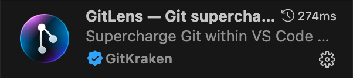
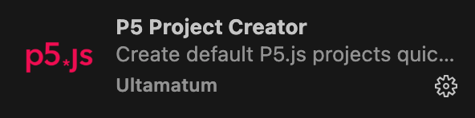

# Setting up your Development Workspace

## Summary

### Accounts to Create
- [GSome features we will be using require you to be logged in. You should log in with your Github account. Once logged in, you won't have to redo this unless you manually log out.

1. In the bottom left corner, click the account icon
2. This will trigger an authentication with Github in your browser
3. Click "Allow" to authorize the connection

#### Step 2 – Install GitLens extensionb](https://github.com)

### Software to Install
- [VS Code](https://code.visualstudio.com/download)
- [Github Desktop](https://desktop.github.com/download/)
- [Git (PC Only)](https://git-scm.com/downloads)

### Mobile App to Install
- Github Mobile App

### VS Code Extensions to Install
- GitLens
- p5js Snippets
- P5 Project Creator
- Live Server
- Github Actions

---

## Step By Step
### Part 1 – Visual Studio Code

#### Step 1 – Download and Install Visual Studio Code

Visual Studio Code (which is different from Visual Studio) is a free/open source development environment that has become one of the most common platforms for coding. One of its main features is that it allows people to create Extensions that customize the environment for different coding languages.

**Links:**
- [VS Code Download](https://code.visualstudio.com/download)

### Part 2 – Git & Github

#### Step 1 – Create a Github account using your .ocadu email address

You will be using Github in multiple ways:
- Writing your code inside a project repository
- Online backup of the code
- Login mechanism for specialized VS Code functionality
- Accessing Github Copilot features
- Hosting your web app code through Pages

**Links:**
- [Creating a Github Account](https://docs.github.com/en/get-started/start-your-journey/creating-an-account-on-github)

#### Step 2 – Install the Github Mobile app on your phone

Like most applications, Github requires Two Factor Authentication for login and adding services.

**Links:**
- [iOS App Store](https://apps.apple.com/us/app/github/id1477376905)
- [Android Play Store](https://play.google.com/store/apps/details?id=com.github.android&hl=en&pli=1)

#### Step 3 – Install Github Desktop

Github Desktop is an application that simplifies basic tasks of cloning repositories and managing push/pull requests. It is possible to do all of this through the Terminal, but it is highly recommended to install it.

**Links:**
- [Github Desktop Download](https://desktop.github.com/download/)

#### Step 4 – Open the Github Desktop Application and Log In

You will need to authenticate Github Desktop in the browser and through 2FA.

#### Step 5 – **PC ONLY** Download and Install Git

Git is different from Github. Git is the actual command/database software for your computer that allows you to manage the development process of your files.

**Links:**
- [Git Downloads](https://git-scm.com/downloads)

### Part 3 – Bringing VS Code, P5, Git, and Github together

#### Step 1 – Open VS Code and Log In with your Github account
Some feature we will be using require you to be logged in. You should log in with your Github account. Once logged in, you won’t have to redo this unless you manually log out.
In the bottom left corner, click the account icon and choose XXX
This will trigger an authentication with Github in your browser. Click allow.
#### Step 2 – Install Gitlens extension

GitLens allows you to very simply version your project. It allows you to track files by snapshots in time rather than by filename. It also handles syncing the changes with Github.

1. Open the Extensions panel inside VS Code by clicking the Extensions icon in the left sidebar
2. In the search bar type: `GitLens`
3. Select it and then press the Install button

#### Step 3 – Install P5 Extensions
These extensions assist with code completion that is specific to P5 and also with creating new projects.

1. **p5js Snippets:**

   - In the Extensions panel, search: `p5js Snippets`
   - Select it and press the Install button

2. **P5 Project Creator:**

   - In the Extensions panel, search: `P5 Project Creator`
   - Select it and press the Install button

#### Step 4 – Install Live Server

Live Server runs a local webserver to allow you to develop the HTML page locally on your machine and also access it from other devices.

1. In the Extensions panel, search: `Live Server`
2. Select it and press the Install button

#### Step 5 – Install Github Actions

We will be using Github Actions to automatically build a new version of our html page each time the code is synced with the repo

1. In the Extensions panel, search: `Github Actions`
2. Select it and press the Install button

#### If Completed Correctly this is how your extensions should look

