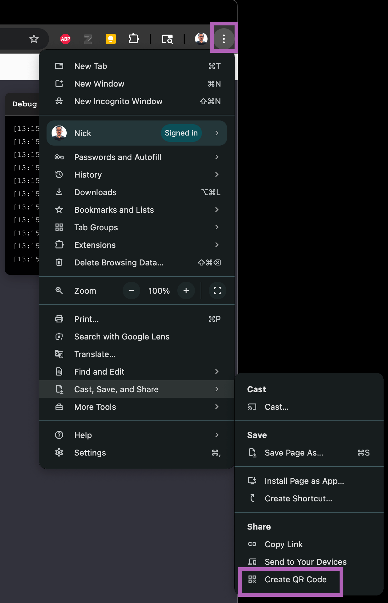
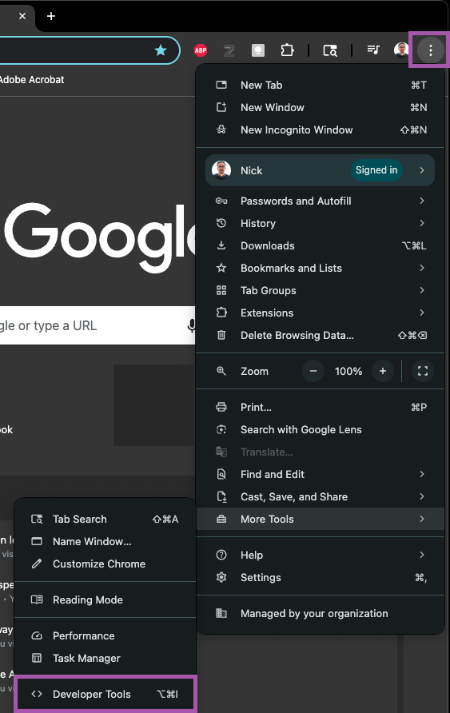
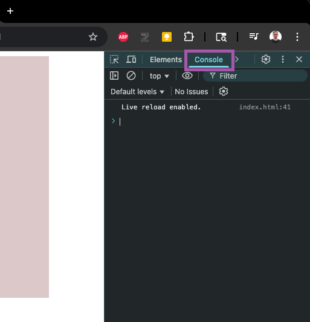

# Chrome Tools for mobile web development

Chrome has several tools built in that help with developing apps for mobile devices. It is not the only browser that can do this, but it is simple to use

## Part 1 - Creating QR codes for URLS

One of the basic methods we use for opening urls on mobile is via QR code. There are endless websites that can perform this task, but it is convenient that it is built into Chrome

- Click the 3 dots in the top right to open the menu
  - Cast, Save, and Share
    - Create QR Code

## Part 2 - Using the Debug Console

When developing locally, you need access to the debug console to see errors and any console.log() messages you create. We will use the console built into Chrome for this task

Step 1 - Open the Dev Tools

Chrome has an entire suite of tools built in that are helpful for developing on the web. They can be accessed either via the Settings menu or via hotkeys.

- Click the 3 dots in the top right to open the menu
  - More Tools
    - Developer Tools
- Hotkeys
  - MacOS : **Cmd + Option + J**
  - **Windows : Cmd + Option + J**

