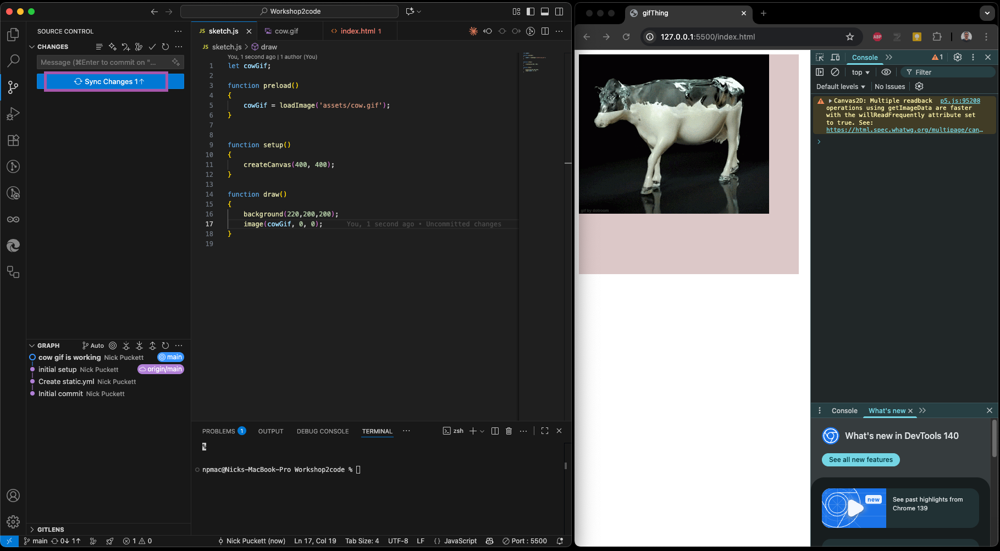

# Coding P5 locally using your Repo

## Important commands and locations in VS Code

### Command Palette

This is where you execute specific commands inside VS code.

- To open it
  - View - > Command Palette
  - Hotkeys
    - Windows : Ctrl + Shift + P
    - MacOS : Cmd + Shift + P

### Terminal

VS Code also has access to your Terminal inside the software. This is used for a variety of tasks within the development cycle.

- To open it
  - View - > Terminal
  - Hotkeys
    - Windows : Ctrl + \`
    - MacOS : Ctrl + \`

## Part 1 - Create a new p5 project inside your Repo

It is important that you have already completed the steps of setting up a repo and cloning it to your computer. This guide assumes you have opened that folder in VS Code.

### Step 1 - Execute 'Create P5 Project'

Open the Command Pallette and use 'Create P5 Project'

- Open the Command Pallette
- Start typing 'p5'
- This will bring up the 'Create P5 Project' command
- Click it

### Step 2 - Name the Project

Give the project a name. This will be shown as the title in the index file

- Give it a name
- Press Enter
- This will generate
  - Index.html file with p5 sourced
  - Sketch.js file that is linked to the index file

### Step 3 - Update the P5 Version

This isn't always necessary, but it is generally a good idea to update the p5 version to the current one.

- Inside the index file edit the link to point to a more current version of p5

## Part 2 - Set up a live preview of what the site will look like

Similar to the p5 web editor, you need to have a view of what your code will look like. To do this we need to launch a webserver on your local machine to host the code. This will update automatically each time you save the index file

### Step 1 - Open your index file with Live Server

This uses the Live Server extension to simplify the process of creating a server

- Right Click on index.html
- Select Open with Live Server
- This will open a web browser running your index page

### Step 2 - Open the web console

To see errors or any console.log command outputs, you need to open the console in the browser. After this step you are ready to start coding

- Click the 3 dots
- More Tools
- Developer Tools
- This will open the console

## Part 3 - Saving your progress using Git

Once you start making progress on your code, you'll want to save particular versions of the code. However, you won't be changing the filename, you will be creating new commit points using Git.

### Step 1 - Open the Source Control panel and name your message

This panel contains all of the tools to interact with Git and your repo. Instead of giving the file a new name, you will write a message that describes the current state of the project

- Open the Source Control panel
- Write a commit message in the box
  - Be descriptive of the current state
- Press Commit
- You have now saved the current state of your project

### Step 2 - Sync the current state with Github

Making the commit saves the current state locally, but you also want to synchronize it with your online Github repo.

- Press Sync Changes to upload it to Github
- You can now see the changes reflected in your repo online

### Step 3 - View the hosted version of the website

Because we set up the Repo with Pages, each time you sync the code, it also builds a version of the site at its url.

https://&lt;github username&gt;.github.io/&lt;name of your repo&gt;

