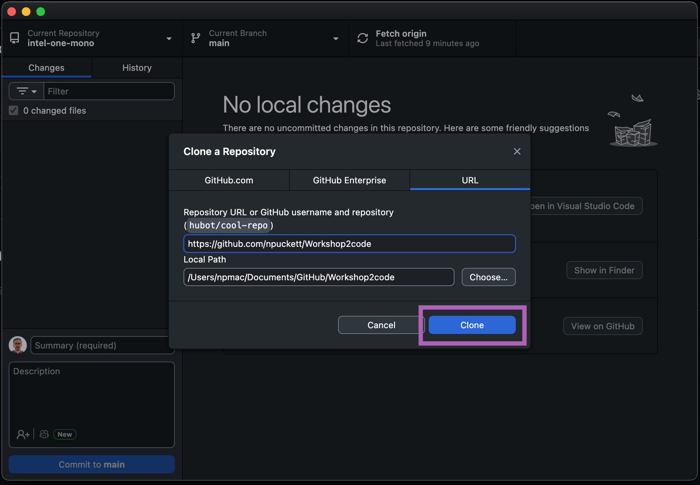
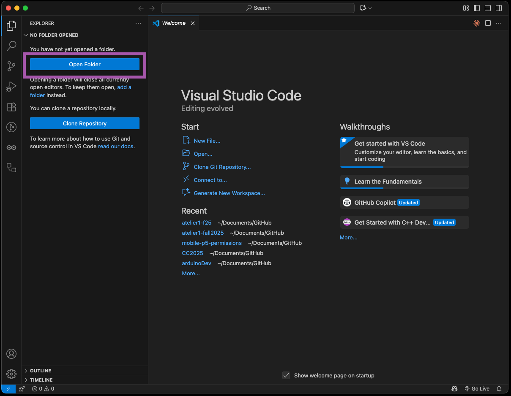
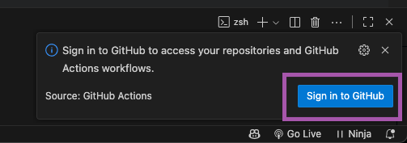

# Setting up a Github Repo for Development and Webhosting

We will be using Github for two functions simultaneously:

- Backup of version management of the code written
- Acting as the web hosting service

## Part 1 Setting up a new Repo for Development

### Step 1 - Create a Repo on Github

A repository (repo) is the basic unit of Github. This is the place where all of the code you write will be synced to online. There are many different things you can do with a repository, so it requires several settings to be set to make it optimized for mobile development.

1. Go to [github.com](https://github.com) (sign in if you aren't already)
2. Click **New** Button
3. Fill out the properties:
   - Name
   - Description
   - Be sure it is **public**
   - Turn on **Add README**
4. Click **Create Repository**

### Step 2 - Enable Github Pages in the Repo

In addition to using Github to manage our code development, we will also be using it as a webhost for the developed web apps.

1. Open the url of the repository you created
2. Click:
   - **Settings** at the top of the page
   - **Pages** on the left
   - Under **Build and deployment** click **Source** dropdown and choose **Github Actions**

### Step 3 - Set up the Github Action

Using a Github Action instead of 'Deploy from branch' builds the updated code much faster with reduced caching issues.

1. Once you select Github Actions from the dropdown it will give you 2 options
2. Under **Static HTML**, choose **Configure**

### Step 4 - Commit the Changes to the Repo

To implement this change to the Pages build process, you must commit the static.yml file to the repo.

1. When the file opens:
   - Do not make any changes to the file
   - Press the **Commit changes...** button in the top right

2. When the Commit changes dialog opens:
   - Create a Commit message (or use the generated one)
   - Click the **Commit changes** button

### Step 5 - Confirm the url of your Pages site

After you commit the changes, it will start create your webspace for this repo. Pages hosted through github are created with this naming pattern:

`https://your-github-name.github.io/name-of-your-repository/`

You can confirm that it worked by going back to **Settings → Pages** and seeing that it confirms the site

## Part 2 – Clone the Repo to your Computer

### Step 1 - Clone the repo from the website

'Cloning' refers to the action of downloading the repo onto your computer so that it can synchronize the files. You can also clone repos that you didn't create, but there is a specific capability when cloning from your own account.

1. On the Repo page Click the **Code** Button and choose **Open with Github Desktop**
2. This will download the repo to your computer and open Github Desktop

### Step 2 - Complete the clone using Github Desktop

Github Desktop is used to complete this process of creating a local repo folder on your computer.

1. When Github Desktop opens, simply click the **Clone** button
2. At this point the repo is synced locally to its folder on your computer. Unless you specify somewhere else, that is typically:
   - **Windows:** `/My Documents/Github/Repo Name`
   - **MacOS:** `/Documents/Github/Repo Name`
3. If the folder is created in this location, you can close Github Desktop

### Step 3 – Open the local repo folder in VS Code

Now that the folder is created, you need to open it in VS Code to start coding.

1. To open it in VS Code either navigate **File → Open Folder** or use the **Open Folder** Button

### Step 4 – Activate Github Actions

Because we are using Github Actions to deploy our pages, VS Code will want to enable the extension.

1. In the bottom right click **sign in**

2. Click **Allow**