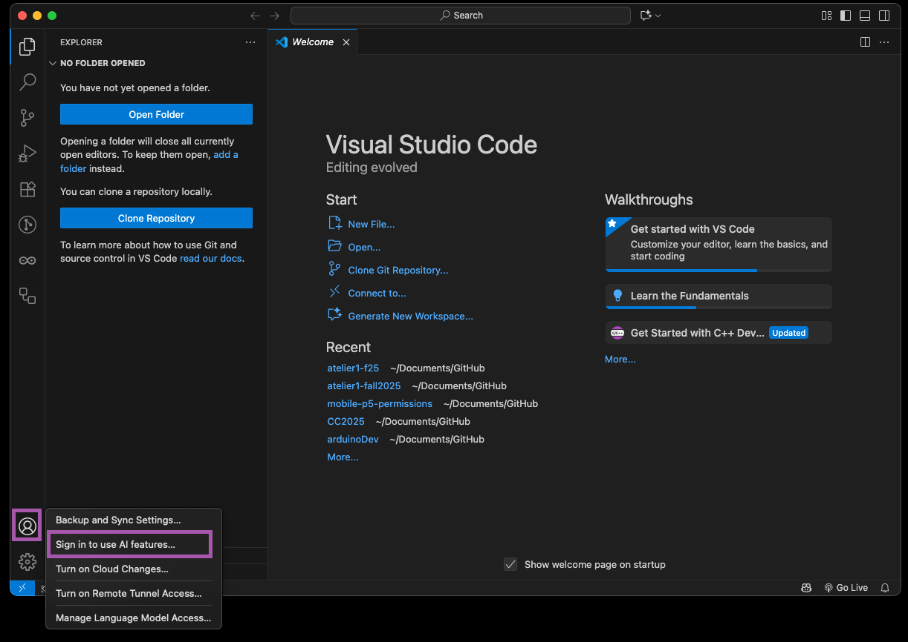
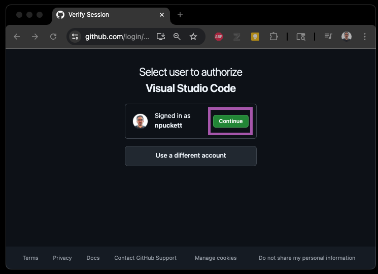
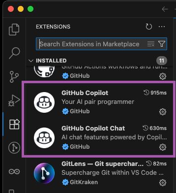
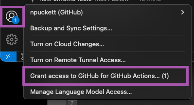
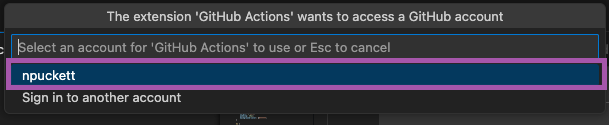

# Signing into VS Code, Gitlens, and Actions

It is possible to use VS Code without signing it, but many tools and extensions require it. You will use your Github account to sign in for each item. Once you do this, you should stay signed in unless you manually sign out.

## Part 1 - Sign In to VS Code & Github Copilot

Signing in will give you access to advanced tools in VS Code and will also automatically install the Github Copilot and Github Copilot Chat Extensions.

### Step 1 - Click Sign In

Use the Account menu to sign in.

- Click the Account menu in the bottom left
- Select 'Sign in to use AI features…\`

### Step 2 - Select to Sign In with Github

You can sign in to VS Code with a variety of accounts, but you should always choose to use your Github account to keep things organized

- From the popup, choose 'Continue with Github'

### Step 3 - Authorize in the Browser

If you are already signed into your Github account online, it will ask you Authorize. If not it will ask you sign in first.

- Click Continue

### Step 4 - Check that you now have Copilot Extensions

These steps will install both Copilot extensions and attach them to your Github account.

## Part 2 - Sign In to Gitlens

### Step 1 - Select it from the Account Menu

To connect Gitlens to your Github account, you need to sign in and authorize it

- Click your Account menu
- Select Sign In with Github to use GitLens - Git supercharged

### Step 2 - Authorize in the browser

If you are already signed into your Github account online, it will ask you Authorize. If not it will ask you sign in first.

- Click Continue

## Part 3 - Allow Access for Github Actions

We need to authorize the Github Actions extension, so that it can access our account and repos.

### Step 1 - Select it from the Account Menu

For security, you must explicitly grant the extension access to your account.

- Click your Account menu
- Select Grant access to Github for Github Actions…

### Step 2 - Confirm the account to connect

Select your Github account id from the command palette

